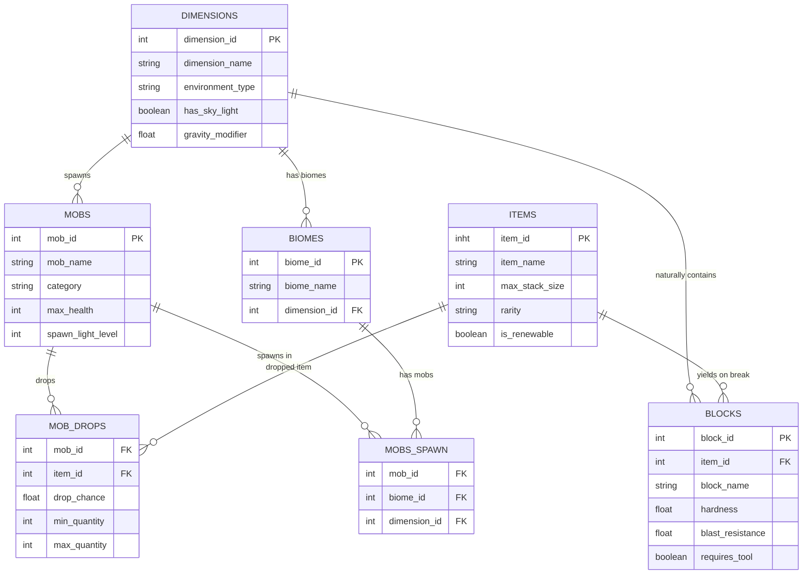

```mermaid
erDiagram
    DIMENSIONS ||--o{ MOBS : "spawns"
    DIMENSIONS ||--o{ BLOCKS : "naturally contains"
    DIMENSIONS ||--o{ BIOMES : "has biomes"
    ITEMS ||--o{ BLOCKS : "yields on break"
    MOBS ||--o{ MOB_DROPS : "drops"
    MOBS ||--o{ MOBS_SPAWN : "spawns in"
    BIOMES ||--o{ MOBS_SPAWN : "has mobs"
    ITEMS ||--o{ MOB_DROPS : "dropped item"

    DIMENSIONS {
    int dimension_id PK
    string dimension_name
    string environment_type
    boolean has_sky_light
    float gravity_modifier
}

    BIOMES {
    int biome_id PK
    string biome_name
    int dimension_id FK
    }

    MOBS {
    int mob_id PK
    string mob_name
    string category
    int max_health
    int spawn_light_level
}

    MOBS_SPAWN {
    int mob_id FK
    int biome_id FK
    int dimension_id FK
    }

    ITEMS {
    inht item_id PK
    string item_name
    int max_stack_size
    string rarity
    boolean is_renewable
}

    BLOCKS {
    int block_id PK
    int item_id FK
    string block_name
    float hardness
    float blast_resistance
    boolean requires_tool
}

    MOB_DROPS {
    int mob_id FK
    int item_id FK
    float drop_chance
    int min_quantity
    int max_quantity
}
```