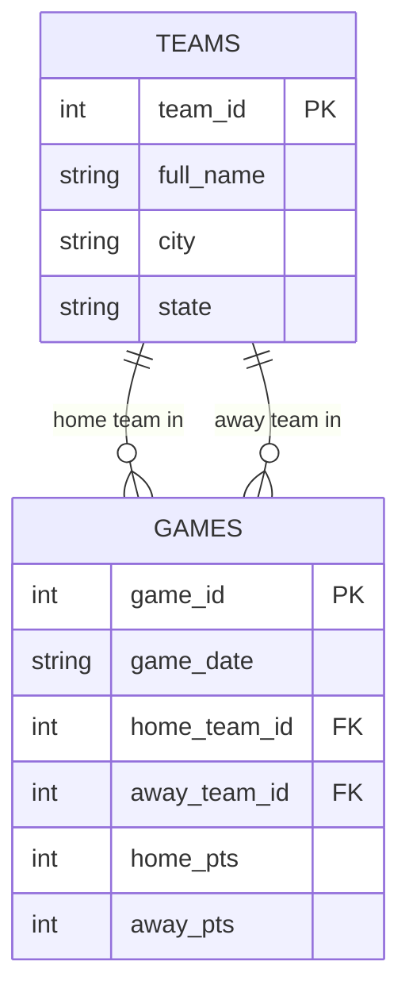
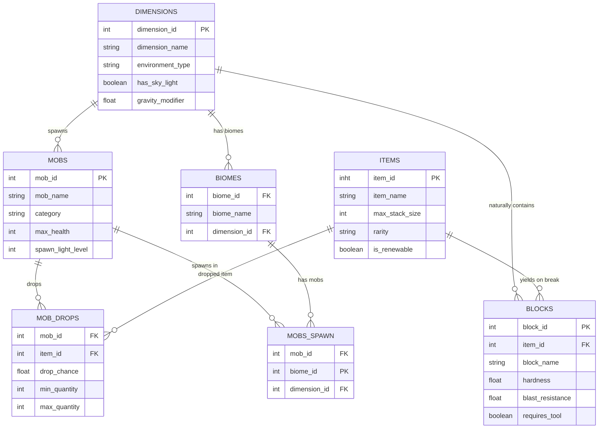

**Before you start:** rename this file to `unit3b_lastname.md`, using your own last name. Read `unit3b_Walkthrough.md` first. Commit and push when you're done.

**Name: Michael McCarty**

---

# Unit 3b — Keys and Relationships

## 1. Which key?

For each table, decide: is the primary key **natural** (a real-world value that already exists, like an email) or **surrogate** (a made-up ID number)? Is it **composite** (more than one column)?

| Table | Primary key | Natural or surrogate? | Composite? |
|---|---|:-:|:-:|
| `teams` in `nba_5seasons.db` | `team_id` | surrogate| no|
| `player_season_stats` in `nba_5seasons.db` | | | |
| A US state table | `state_abbrev` (OH, MI, PA…) | natural| no|
| The school's student records | `student_id` | surrogate| no|

**a.** The school could use a student's full name as the primary key instead of `student_id`. Give one reason that's a bad idea.

**Answer: If their name changes or shares a name with another student**


## 2. What a foreign key promises

**b.** In `denormalized_demo.db`, `games.home_team_id` is a foreign key to `teams.team_id`. If someone tries to insert a game with `home_team_id = 99` and there is no team 99, what should the database do? What is that rule called?

**Answer: throw an error. Rferential Integerity**


**c. If team 6 were deleted from `teams`, what should happen to its rows in `games`? Name two different choices a designer could make.**

**Answer: block the delete/won't let it be deleted (RESTRICT/NO ACTION), OR, delete the games too (cascade)**


## 3. Sort the relationships

**Choose from:** One-to-one · One-to-many · Many-to-many

| # | Relationship | Type |
|:-:|---|---|
| 1 | One team → its games this season | one-to-many|
| 2 | Students ↔ the courses they're enrolled in | many-to-many|
| 3 | A person → their Social Security number | one-to-one|
| 4 | A customer → their orders | one-to-many|
| 5 | Movies ↔ the actors in them | many-to-many|
| 6 | A country → its capital city | one-to-one|

**d.** Pick either many-to-many row. Relational databases can't store a many-to-many directly. What table do you add, and what columns does it need?

**Answer: A junction table. atleast any columns (those being a foreign key), to link to a Primary Key of the other tables**


**e.** Not every database uses tables and keys. In a **graph** database (like the one behind Instagram's follow list), the same "who follows whom" relationship is stored as what two things? In a **key-value** store, how is a relationship handled?

**Answer: nodes and edges**


## 4. Your first ER diagram

Here is the `denormalized_demo.db` fixed version as a Mermaid diagram. It already renders — push and look at it on GitHub or preview it in VS Code.



**Now make your own, using AI.** Follow the four steps in the walkthrough: plan it, prompt the AI, proof it, test it. A school schedule has these entities: **STUDENTS**, **COURSES**, **TEACHERS**, and an **ENROLLMENTS** junction table. Rules:

- One teacher teaches many courses; each course has one teacher.
- Students take many courses; courses have many students. (That's what ENROLLMENTS is for.)

Give every entity a primary key and at least two attributes. Mark the foreign keys.



**Paste the prompt you gave the AI.** If you used a PowerPoint picture, add the picture to your repo too.

```text
give me mermaid code for an ER diagram. The tables are Minecraft themed. A table for mobs, a table for blocks, a table for items, a table for dimension, one for mob drops, one for mob spawns (dimenions ND biome), and one for biomes. Each table should have a unique ID incase the name changes, so a mob_id, Dimension_id, block_id, item_id, biome_id. for mobs drops, use item_id and mob_id both are FK in that table and are PK and their respective home table. Do this for the other tables as well.
```

**f.** Which entity has two foreign keys? What should its primary key be?

**Answer: Mob_Spawn, the primary key is the biome_id**


**g.** What did you have to fix in the AI's diagram? If you didn't change anything, what did you check to make sure it was right?

**Answer: I had to change a few names and add a few things, like removing mob_drop_id, as it is just an item, so it would just use item_id.**


## Closing 3b — Vocabulary

| Term | Your definition |
|---|---|
| Entity | an object with attributes that can be connected to another entity via those attributes|
| Attribute | the data of the entity, can be used as a key to link other entities|
| Natural key | naturally accuring value used as a key (such as name or Username)|
| Surrogate key | A made-up value used as a key (such as an ID)|
| Composite key | a key made of multiple keys|
| Referential integrity |keeps the database/table integrity|
| Junction table |A table to connect other tables |
| Cardinality |how records can be related |

**Partner check:** trade files. Read your partner's Mermaid code out loud, one relationship line at a time, as English ("one teacher, many courses"). If it doesn't read right, one of you has the crow's foot on the wrong end.